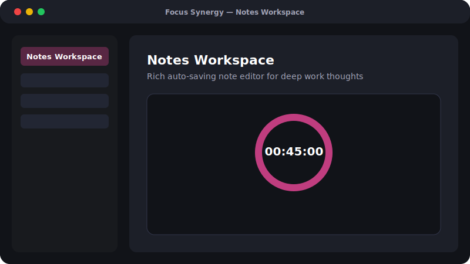

# Focus Synergy

**Track focus loops. Build lasting habits.**

A calm, keyboard-friendly workspace for deep work — timers, habits, seasons, notes, and analytics in one place. No context switching, no clutter.

License: MIT · Built with Tauri · Vanilla JS · Firebase · Rust

## What is Focus Synergy?

Focus Synergy is a productivity dashboard that helps you log deep work sessions, maintain consistency streaks, and audit your focus patterns — all from a single, clean interface.

It's built around one truth: **tracking only works if it's frictionless.**

Sign in with email or Google for real-time cloud sync via Firebase, or choose **Local Mode** to keep data entirely on your device. It runs as a website or a native desktop app powered by Tauri.

## Screenshots




## Features

- **Deep Work Timer** — create *Topics* or *Habits*, then start, pause, and log focused sessions with a live counter and per-item timers.
- **Analytics & Highlights** — see time allocation and top focus metrics across your tracked items at a glance.
- **Activity Calendar** — a year-long focus heatmap plus a navigable month calendar showing daily intensity.
- **Seasons Planner** — structured 4–6 week focus blocks with a professional/personal goal, a daily "non-negotiable minimum" micro-habit, and a daily energy log (high-energy production vs. low-energy consumption).
- **Not-Right-Now Backlog** — park ideas, frameworks, and hobbies so they don't distract your current season.
- **Notes Workspace** — a rich-text notes editor (bold, italic, lists) that auto-saves as you type.
- **Multi-provider Auth** — Email/Password and Google Sign-In.
- **Live Sync** — every change is mirrored to Firestore in real time via snapshot listeners.
- **Tiny desktop shell** — Tauri wraps the web app in a native window (~10 MB), far lighter than Electron.
- **Responsive UI** — Tailwind CSS, looks good on phone and desktop.

## Tech Stack

| Layer | Technology |
| --- | --- |
| Shell | Tauri 2 — native window, OS integrations |
| Frontend | HTML5, CSS3, Vanilla JavaScript (ES6+ modules) |
| Styling | Tailwind CSS (CDN), Lucide Icons (CDN), Plus Jakarta Sans (Google Fonts) |
| Backend-as-a-Service | Firebase Auth + Cloud Firestore (loaded via ESM CDN) |
| Realtime | Firestore `onSnapshot` listeners per collection |
| Core | Rust — Tauri runtime, IPC, window management |
| Build Tooling | Node.js, `@tauri-apps/cli`, Cargo (Rust toolchain) |
| Packaging | MSI + NSIS (Windows) · DMG (macOS) · .deb + AppImage (Linux) |

## Project Structure

```
Focus Synergy/
├── frontend/                # Static web app (vanilla JS)
│   ├── index.html           # Marketing / landing page
│   ├── dashboard.html       # Authenticated app shell (login, tracker, calendar, notes, seasons)
│   ├── env.js               # Injected Firebase + Cloudinary config (generated; see .env.example)
│   └── fav.png
├── src-tauri/               # Rust desktop shell
│   ├── src/
│   │   ├── main.rs          # Entry point, calls the library run()
│   │   └── lib.rs           # Tauri builder, plugins, context
│   ├── tauri.conf.json      # App config (product name, identifier, window, bundling)
│   ├── Cargo.toml           # Rust package manifest
│   └── Cargo.lock
├── scripts/
│   ├── static-server.js     # Local dev server on :5173
│   └── build-frontend.js    # Copies/generates frontend/env.js from .env
├── package.json             # npm scripts (dev, build, tauri)
└── README.md
```

## Data Model

Data is stored per-user under `users/{uid}/` in Firestore, one collection per feature:

- `items` — topics and habits with running timers (`accumulatedSeconds`, `startedAt`, `isRunning`)
- `logs` — completed focus sessions (seconds logged per item)
- `notes` — rich-text notes (title + body, auto-saved)
- `seasons` — focus blocks with dev/personal goals and micro-habits
- `backlog` — parked ideas
- `dailyLogs` — per-day energy-mode activity entries
- `habitLogs` — daily micro-habit completion

## Download

| Platform | Architecture | Download |
| --- | --- | --- |
| Windows | x64 | `FocusSynergy_0.1.0_x64-setup.exe` · `FocusSynergy_0.1.0_x64_en-US.msi` |
| macOS | Apple Silicon (M1/M2/M3) | `FocusSynergy_0.1.0_aarch64.dmg` |
| macOS | Intel | `FocusSynergy_0.1.0_x64.dmg` |
| Linux | x86_64 | `FocusSynergy_0.1.0_amd64.deb` · `FocusSynergy_0.1.0_x86_64.AppImage` |

> Build installers yourself with `npm run tauri build` — artifacts land in `src-tauri/target/release/bundle/`.
>
> Releases are not code-signed on Windows/macOS by default — you may see a SmartScreen/ Gatekeeper warning.

## Build from Source

**Prerequisites:** Rust stable · Node.js 18+ · Cargo on PATH · WebView2 (Windows)

```bash
# 1. Configure Firebase credentials
cp .env.example .env
#    Edit .env with your Firebase project values. .env is git-ignored and is
#    the ONLY place secrets live — frontend/env.js is generated from it and
#    is also git-ignored, so no credentials are ever committed.

# 2. Install JS dependencies (Tauri CLI)
npm install

# 3. Generate frontend/env.js from .env
npm run build:env

# 4. Run in dev mode (hot-reload UI + Rust backend)
npm run dev
# or double-click dev.bat on Windows

# 5. Build a release binary + installer for your platform
npm run build
```

Built artifacts land in `src-tauri/target/release/bundle/`.

### Run the web app only

```bash
# Generate env.js and serve the static frontend
npm run build:env
npx serve frontend
# or
python -m http.server 3000 frontend
```

### Desktop-only step (Google Sign-In)

Tauri's webview runs on `http://localhost`. For Google login in the desktop app, add `localhost` to Firebase → **Authentication → Settings → Authorized domains**. The app auto-switches Google login from popup to redirect flow when running in Tauri — no code change needed.

## Contributing

Focus Synergy is open source and contributions are welcome.

1. Fork the repository.
2. Create a feature branch: `git checkout -b feature/amazing-feature`.
3. Commit: `git commit -m 'Add amazing feature'`.
4. Push: `git push origin feature/amazing-feature`.
5. Open a Pull Request.

Please keep the UX calm and low-friction — no feature should add cognitive load to someone mid-focus-session.

## Support

Focus Synergy is free and open-source, built to help you focus better, one session at a time.

## License

MIT © Focus Synergy
